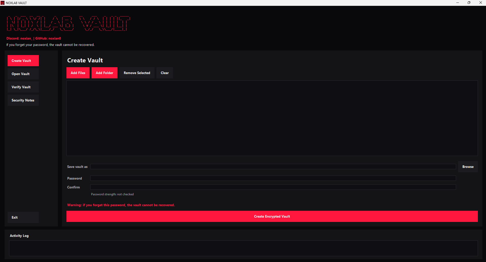
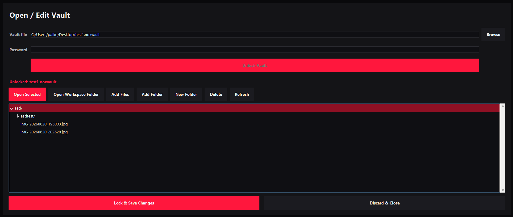

# NOXLAB VAULT

NOXLAB VAULT is a local Windows file vault utility for protecting personal files and folders inside a single encrypted `.noxvault` file.

It is local only. There is no account, no cloud sync, no remote server, and no internet dependency in the application.




## Features

- Create a `.noxvault` file from selected files and folders.
- Unlock an existing vault into an editable temporary workspace.
- Open files from the app, edit them in normal Windows applications, then lock and save the vault.
- Verify a vault password without extracting files.
- Encrypts the whole archive as one blob, so filenames, folder names, and file contents are hidden.
- Uses authenticated encryption so wrong passwords, edits, and corruption fail during decryption.
- Blocks Open and Verify for 5 hours after 5 failed password attempts for the same vault identity.
- Shows password strength feedback and clear password-loss warnings.
- Cleans temporary plaintext files after locking or discarding an unlocked vault.

## Security Model

NOXLAB VAULT does not use custom encryption.

- Archive format: ZIP archive created from selected files/folders.
- Encryption: AES-256-GCM from the `cryptography` package.
- Authentication: AES-GCM authentication tag is included in the encrypted payload produced by the library.
- Key derivation: Argon2id through `argon2-cffi` when available.
- Fallback KDF: PBKDF2-HMAC-SHA256 with a high iteration count if Argon2id is not installed.
- Every vault gets a random salt.
- Every encryption gets a random 96-bit AES-GCM nonce.
- The plaintext password is never stored.
- The derived encryption key is never stored unencrypted.
- Passwords and key material are never logged or printed.

The vault header stores only technical metadata needed to decrypt the vault: magic value, version, KDF type, KDF parameters, salt, and nonce. File names and folder structure are inside the encrypted ZIP blob.

## Important Password Warning

If you forget the password, the vault cannot be recovered.

NOXLAB VAULT has no backdoor, recovery key, admin override, or cloud account reset. Weak passwords can be guessed, so use a long unique password or passphrase. A length of 16+ characters is strongly recommended.

## Local-Only Disclaimer

NOXLAB VAULT does not upload files, passwords, keys, telemetry, or vault metadata. It performs all work on the local computer.

Malware or a compromised Windows account can still access files while they are unlocked. Do not store the vault password next to the vault file.

When a vault is unlocked for editing, its contents are temporarily decrypted on this PC so normal Windows apps can open and modify them. Use `Lock & Save Changes` to re-encrypt the updated workspace back into the vault. Use `Discard & Close` to close the temporary workspace without saving changes.

Temporary plaintext files are deleted after locking or discarding. Secure deletion cannot be guaranteed on all drives, especially SSDs and journaled filesystems, but the app avoids keeping plaintext temporary files longer than needed and warns if cleanup fails.

NOXLAB VAULT stores a local failed-attempt counter in the user's app data folder. After 5 wrong password or corrupted-vault failures for the same vault identity, Open and Verify are blocked for 5 hours, even if the app is closed and reopened. This lockout is an app-level safety feature and does not replace using a strong password.

## How to Run on Windows

1. Install Python 3.10 or newer.
2. Extract the NOXLAB VAULT release ZIP to a folder you want to keep.
3. Run the setup script:

```powershell
.\SETUP.cmd
```

The setup script creates `.venv`, installs required packages, verifies the crypto and GUI dependencies, and creates shortcuts.

After setup, start the app from the `NOXLAB VAULT` Desktop shortcut. It opens as a Windows app view, not as a command prompt.

Manual setup is also possible:

1. Create and activate a virtual environment:

```powershell
python -m venv .venv
.\.venv\Scripts\Activate.ps1
```

2. Install dependencies:

```powershell
python -m pip install -r requirements.txt
```

3. Start the app:

```powershell
python .\src\main.py
```

The console fallback is still available:

```powershell
.\NOXLAB VAULT.cmd
```

## Main Menu

```text
1. Create New Vault
2. Open / Edit Vault
3. Verify Vault
4. Security Notes
0. Exit
```

## Edit Workflow

1. Open a `.noxvault` file and enter the password.
2. The app decrypts the archive into a temporary local workspace.
3. The app shows the vault contents in a file tree.
4. Open files from the tree and edit them in normal Windows apps.
5. Save and close those external editor windows.
6. Click `Lock & Save Changes`.
7. The app rebuilds the ZIP archive, encrypts it with a fresh salt and nonce, replaces the vault file, and cleans the temporary workspace.

If you close the app while a vault is unlocked, it asks whether to save and lock or discard the unlocked changes.

## Vault File Format

A `.noxvault` file contains:

- Magic header: `NOXVAULT1`
- Metadata length
- JSON metadata:
  - version
  - KDF type
  - KDF parameters
  - salt
  - nonce
- AES-GCM encrypted ZIP archive data

The metadata bytes are used as AES-GCM associated data. If an attacker edits the vault header or encrypted payload, decryption fails.

## Build / Release Later

For a single-file Windows build, PyInstaller can be used later:

```powershell
python -m pip install pyinstaller
pyinstaller --onefile --name "NOXLAB VAULT" .\src\main.py
```

The generated files will appear in `dist/` and `build/`, which are ignored by git.

Before release, perform a security review and test on a clean Windows machine.

## License

See the `LICENSE` file for the custom NOXLAB VAULT license terms.
